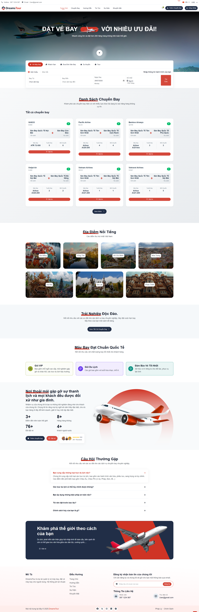
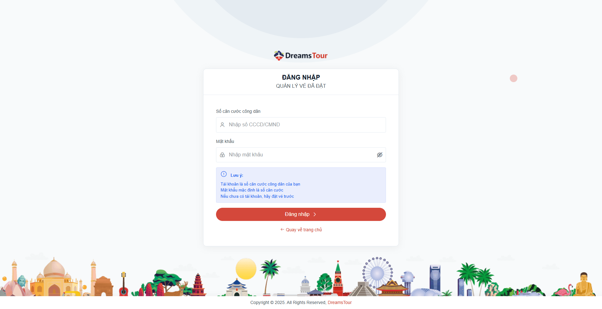
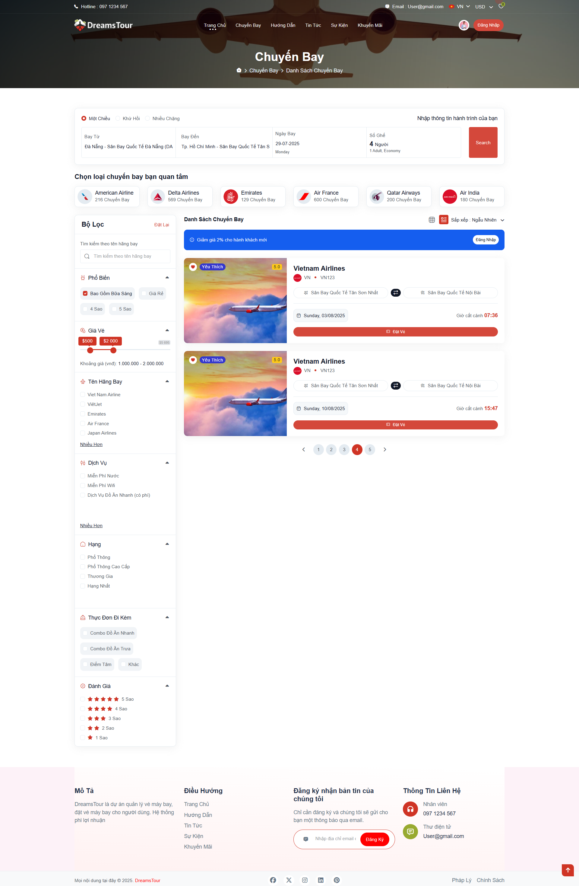
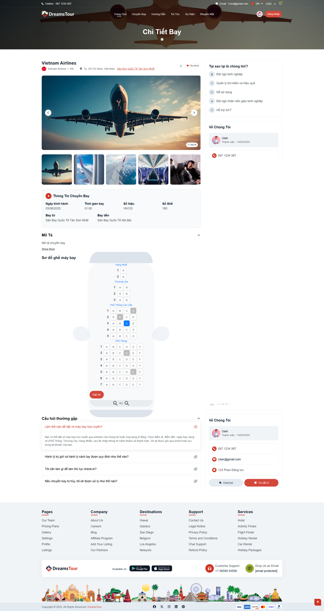
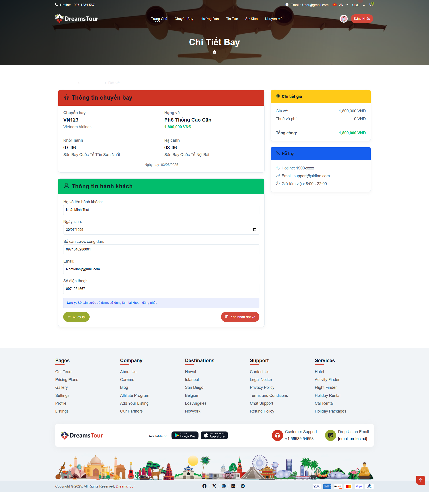
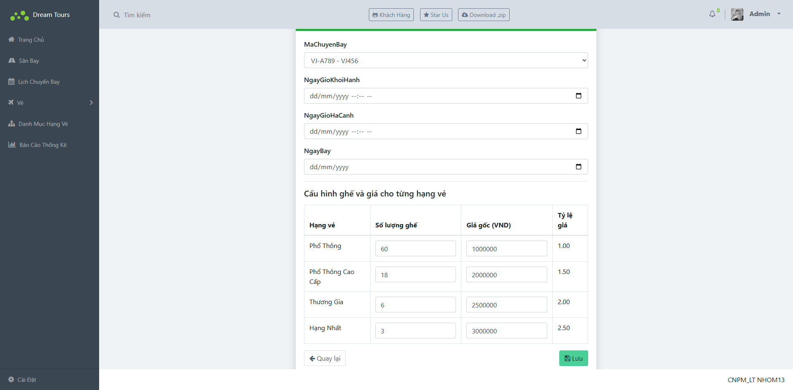
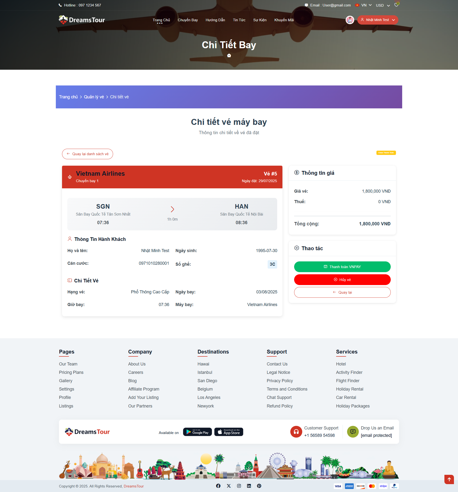
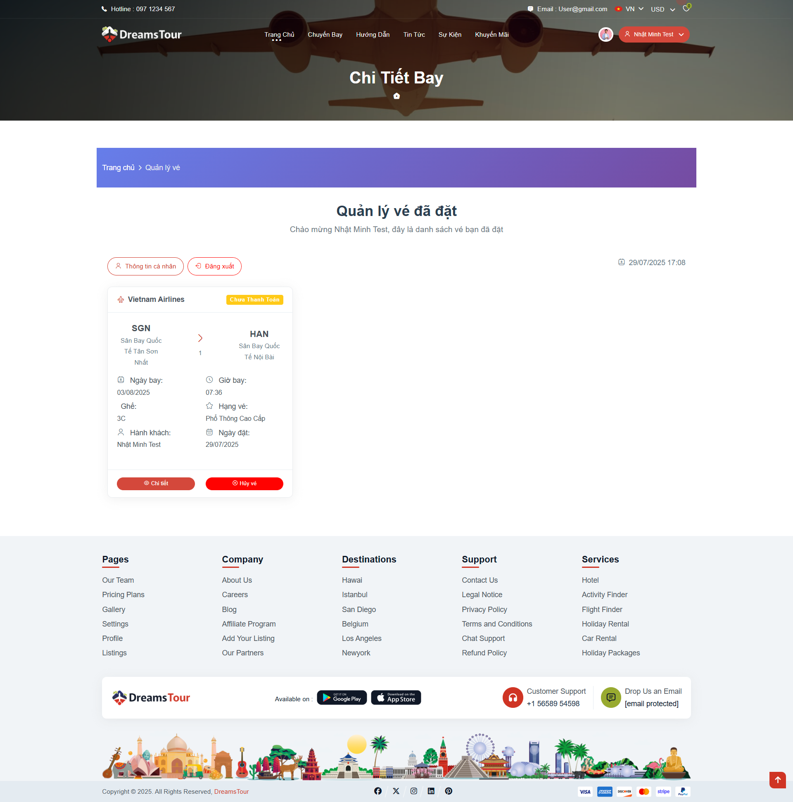
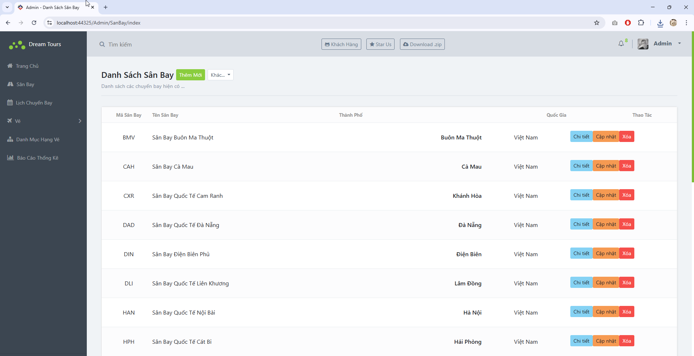

# Airline Ticket Booking - Hệ thống đặt vé máy bay

## I. Môi trường phát triển

- Công cụ: Visual Studio 2022, Microsoft SQL Server
- Framework: ASP.NET MVC 5
- Thư viện: EntityFramework, Razor, Twilio (xác thực SMS), Jquery, Bootstrap, ...

## II. Cài đặt

### 1. Môi trường, công cụ

- SQL Server 2018: [Tải tại đây](https://go.microsoft.com/fwlink/?linkid=866662)
- SQL Server Management Studio (SSMS): [Tải tại đây](https://aka.ms/ssmsfullsetup)
- Visual Studio: [Tải tại đây](https://visualstudio.microsoft.com/thank-you-downloading-visual-studio/?sku=Enterprise&rel=16)

### 2. Khởi tạo cơ sở dữ liệu

- Import file `DatabasePlane.sql` trong thư mục `Database` vào SQL Server để tạo database và các bảng dữ liệu.

### 3. Mở source code và build

- Mở Visual Studio, chọn `AirlineBooking/AirlineBooking.sln` để mở solution.
- Build solution để cài đặt các package cần thiết.

### 4. Cấu hình kết nối database

- Mở file `Web.config` trong thư mục `AirlineWeb`.
- Sửa chuỗi kết nối `connectionStrings` cho phù hợp với tên server và database vừa tạo.

### 5. Chạy project

- Nhấn `Ctrl + F5` trong Visual Studio để chạy ứng dụng.

---

## III. Chức năng chính của hệ thống

### 1. Đối tượng sử dụng

- **Khách hàng:** Đăng ký, đăng nhập, tìm kiếm chuyến bay, đặt vé, thanh toán, quản lý vé đã đặt, nhận thông báo.
- **Nhân viên hãng hàng không:** Quản lý chuyến bay, lịch bay, vé, khách hàng, thống kê doanh thu.
- **Admin:** Quản lý tài khoản nhân viên, hãng hàng không, sân bay, máy bay, tuyến bay, hạng vé, thống kê tổng hợp.

### 2. Chức năng chi tiết

#### a. Khách hàng

- **Trang chủ khách hàng**
  

- **Đăng nhập/Đăng ký**
  

- **Tìm kiếm & Danh sách chuyến bay**
  

- **Chi tiết chuyến bay**
  

- **Đặt vé**
  

- **Quản lý vé đã đặt**
  

- **Chi tiết vé**
  

- **Quản lý đặt vé (lịch sử đặt vé)**
  

#### b. Nhân viên hãng hàng không & Admin

- **Quản lý sân bay**
  

- **Các chức năng khác**
  (Chưa có hình minh họa)
  - Quản lý chuyến bay, lịch bay, vé, khách hàng, hãng hàng không, máy bay, tuyến bay, hạng vé, thống kê doanh thu, tài khoản nhân viên, phân quyền, ...

---

## IV. Cấu trúc thư mục chính

- `AirlineBooking/AirlineWeb/Areas/Customer`: Giao diện và chức năng cho khách hàng.
- `AirlineBooking/AirlineWeb/Areas/Admin`: Giao diện và chức năng quản trị, nhân viên.
- `AirlineBooking/AirlineWeb/Models`: Các model dữ liệu (Chuyến bay, Vé, Lịch bay, Khách hàng, Nhân viên, ...).
- `Database/DatabasePlane.sql`: File khởi tạo cơ sở dữ liệu.

---

## V. Liên hệ & Hỗ trợ

Nếu có thắc mắc về source code hoặc cách sử dụng, vui lòng liên hệ qua email hoặc để lại issue trên repository.
